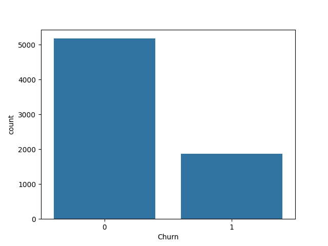
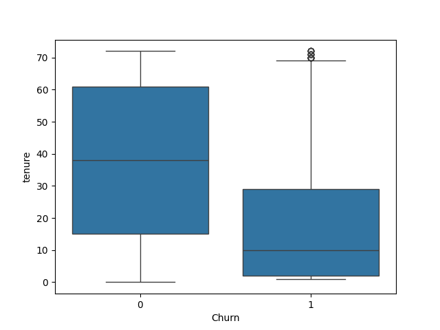

# 📊 Customer Churn Prediction

## 🚀 Project Overview
This project focuses on analyzing customer churn in a telecom company and building a machine learning model to predict customers who are likely to leave the service.

---

## 📂 Dataset
- Telco Customer Churn Dataset  
- ~7000+ customer records  
- Features include tenure, monthly charges, contract type, payment method, etc.

---

## ⚙️ Technologies Used
- Python  
- Pandas, NumPy  
- Scikit-learn  
- Matplotlib, Seaborn  

---

## 🔍 Exploratory Data Analysis (EDA)
- Analyzed overall churn distribution  
- Studied relationship between churn and tenure  
- Identified impact of monthly charges and contract type  
- Visualized patterns using countplots and boxplots  

---

## 🤖 Model Building
- Applied Random Forest Classifier  
- Performed data preprocessing and encoding  
- Used train-test split (80:20)  
- Evaluated model performance using multiple metrics  

---

## 📈 Results
- **Accuracy:** 79%  
- **Recall:** 88% (focused on identifying at-risk customers)  

---

## 💡 Key Insights
- Customers with low tenure are more likely to churn  
- High monthly charges increase churn probability  
- Month-to-month contracts have the highest churn rate  

---

## 📊 Business Recommendations
- Improve onboarding experience for new customers  
- Offer discounts or better plans for high-paying customers  
- Encourage long-term contracts to reduce churn  

---

## 🛠️ Future Improvements
- Hyperparameter tuning  
- Use of advanced models like XGBoost  
- Deployment using Streamlit for real-time predictions  

---
## ▶️ How to Run

1. Clone the repository  
2. Install required libraries  
   pip install -r requirements.txt  
3. Open the Jupyter Notebook  
4. Run all cells to see results   
---
## 📸 Sample Visualizations

---

## 👨‍💻 Author
**Pushkar Avhale**  
🔗 LinkedIn: https://linkedin.com/in/pushkar-avhale  
💻 GitHub: https://github.com/pushkar123451  
